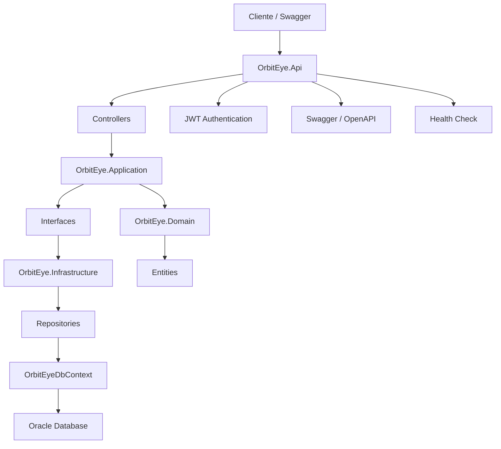
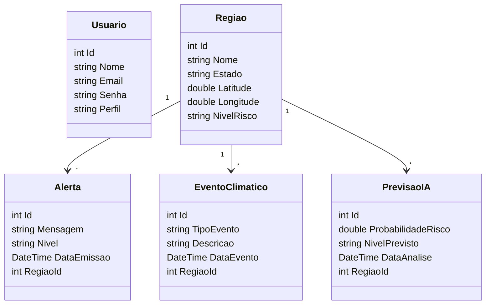
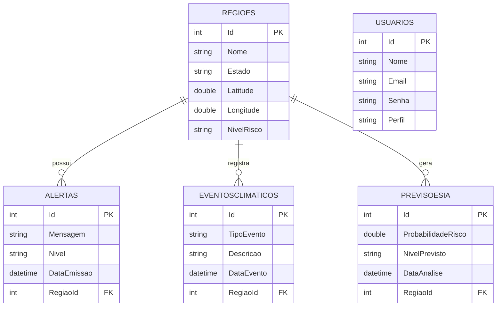

# OrbitEye

## Descrição do Projeto

O OrbitEye é uma API REST desenvolvida em ASP.NET Core para monitoramento climático inteligente.

A solução tem como objetivo auxiliar órgãos públicos e equipes de monitoramento na identificação de riscos climáticos, permitindo o cadastro de regiões, eventos climáticos, alertas e previsões geradas por Inteligência Artificial.

O sistema utiliza Oracle Database para persistência dos dados, autenticação JWT para segurança das rotas e documentação automática através do Swagger.

---

# Tecnologias Utilizadas

- ASP.NET Core 8
- C#
- Oracle Database
- Entity Framework Core
- JWT Authentication
- Swagger / OpenAPI
- Health Checks
- xUnit
- Clean Architecture

---

# Diagramas

## Diagrama de Arquitetura

## Diagrama de Classes

## Diagrama MER

