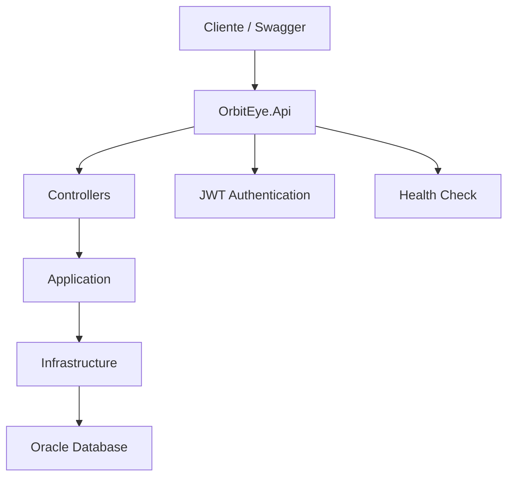
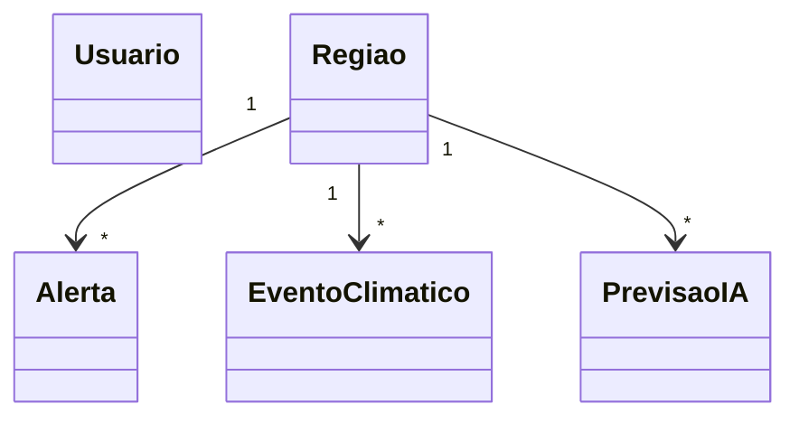
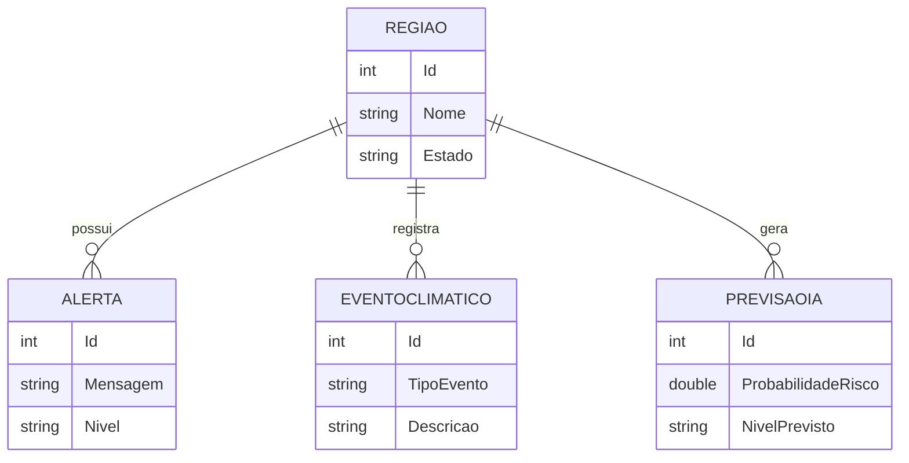

# OrbitEye

## Descrição do Projeto

O OrbitEye é uma API REST desenvolvida em ASP.NET Core para monitoramento climático inteligente.

A solução tem como objetivo auxiliar órgãos públicos e equipes de monitoramento na identificação de riscos climáticos, permitindo o cadastro de regiões, eventos climáticos, alertas e previsões geradas por Inteligência Artificial.

O sistema utiliza Oracle Database para persistência dos dados, autenticação JWT para segurança das rotas e documentação automática através do Swagger.

---

# Tecnologias Utilizadas

- ASP.NET Core 8
- C#
- Oracle Database
- Entity Framework Core
- JWT Authentication
- Swagger / OpenAPI
- Health Checks
- xUnit
- Clean Architecture

---

# Arquitetura da Solução

O projeto foi desenvolvido seguindo o padrão Clean Architecture.

## Estrutura de Camadas

```text
OrbitEye.Api
│
├── Controllers
├── Program.cs
├── appsettings.json
│
OrbitEye.Application
│
├── Interfaces
│
OrbitEye.Domain
│
├── Entities
│
OrbitEye.Infrastructure
│
├── Data
├── Repositories
├── Migrations
│
OrbitEye.Tests
│
├── Testes Automatizados
```

## Camadas

### OrbitEye.Api

Responsável pelos Controllers, autenticação JWT, Swagger e configuração da aplicação.

### OrbitEye.Application

Contém as interfaces utilizadas pelos repositórios.

### OrbitEye.Domain

Contém as entidades de negócio.

### OrbitEye.Infrastructure

Responsável pelo acesso ao banco Oracle, migrations e implementação dos repositórios.

### OrbitEye.Tests

Contém os testes automatizados utilizando xUnit.

---

# Modelo de Dados

O sistema possui as seguintes entidades:

## Usuario

- Id
- Nome
- Email
- Senha
- Perfil

## Regiao

- Id
- Nome
- Estado
- Latitude
- Longitude
- NivelRisco

## Alerta

- Id
- Mensagem
- Nivel
- DataEmissao
- RegiaoId

## EventoClimatico

- Id
- TipoEvento
- Descricao
- DataEvento
- RegiaoId

## PrevisaoIA

- Id
- ProbabilidadeRisco
- NivelPrevisto
- DataAnalise
- RegiaoId

---

# Relacionamentos

Uma Região pode possuir:

- Vários Alertas
- Vários Eventos Climáticos
- Várias Previsões IA

```text
Regiao (1)
   │
   ├── Alertas (N)
   ├── EventosClimaticos (N)
   └── PrevisoesIA (N)
```

---

# Segurança

A aplicação utiliza autenticação JWT.

Após realizar login:

```http
POST /api/Auth/login
```

é gerado um token JWT utilizado para acessar as rotas protegidas.

Exemplo:

```text
Bearer eyJhbGciOiJIUzI1Ni...
```

---

# Documentação da API

A documentação completa da API está disponível através do Swagger.

```text
https://localhost:7285/swagger
```

---

# Health Check

Endpoint utilizado para monitoramento da aplicação.

```text
https://localhost:7285/health
```

Retorno esperado:

```text
Healthy
```

---

# Endpoints Disponíveis

## Auth

### Login

```http
POST /api/Auth/login
```

## Usuários

```http
GET    /api/Usuarios
GET    /api/Usuarios/{id}
POST   /api/Usuarios
PUT    /api/Usuarios/{id}
DELETE /api/Usuarios/{id}
```

## Regiões

```http
GET    /api/Regioes
GET    /api/Regioes/{id}
POST   /api/Regioes
PUT    /api/Regioes/{id}
DELETE /api/Regioes/{id}
```

## Alertas

```http
GET    /api/Alertas
GET    /api/Alertas/{id}
POST   /api/Alertas
PUT    /api/Alertas/{id}
DELETE /api/Alertas/{id}
```

## Eventos Climáticos

```http
GET    /api/EventosClimaticos
GET    /api/EventosClimaticos/{id}
POST   /api/EventosClimaticos
PUT    /api/EventosClimaticos/{id}
DELETE /api/EventosClimaticos/{id}
```

## Previsões IA

```http
GET    /api/PrevisoesIA
GET    /api/PrevisoesIA/{id}
POST   /api/PrevisoesIA
PUT    /api/PrevisoesIA/{id}
DELETE /api/PrevisoesIA/{id}
```

---

# Como Executar o Projeto

## 1. Clonar o repositório

```bash
git clone https://github.com/GabrielNakamura123456/OrbitEye.git
```

## 2. Configurar a conexão Oracle

Editar o arquivo:

```text
appsettings.json
```

Configurando a string de conexão Oracle.

## 3. Aplicar as Migrations

```bash
dotnet ef database update
```

## 4. Executar a aplicação

```bash
dotnet run
```

ou executar diretamente pelo Visual Studio.

---

# Testes Automatizados

O projeto possui testes automatizados utilizando xUnit seguindo o padrão AAA (Arrange, Act, Assert).

## Testes Implementados

### RegiaoTests

Validação da criação de regiões.

### UsuarioTests

Validação da criação de usuários.

### PrevisaoIATests

Validação das previsões geradas pela IA.

## Execução dos Testes

```bash
dotnet test
```

ou através do Visual Studio:

```text
Teste → Executar Todos os Testes
```

Resultado esperado:

```text
3 testes executados
3 testes aprovados
0 falhas
```

---

# Integrantes

| Nome | RM |
|--------|--------|
| Gabriel Nakamura Ogata | RM560671 |
| Julio Cesar Dias Vilella | RM560494 |
| Guilherme Costeira Braganholo | RM560628 |

---

# Disciplina

Advanced Business Development with .NET

FIAP

---

# Objetivo

Demonstrar a construção de uma API REST utilizando ASP.NET Core, Oracle Database, JWT Authentication, Swagger, Health Checks e Testes 

# Diagramas

# Diagramas

## Diagrama de Arquitetura



## Diagrama de Classes



## Diagrama MER


